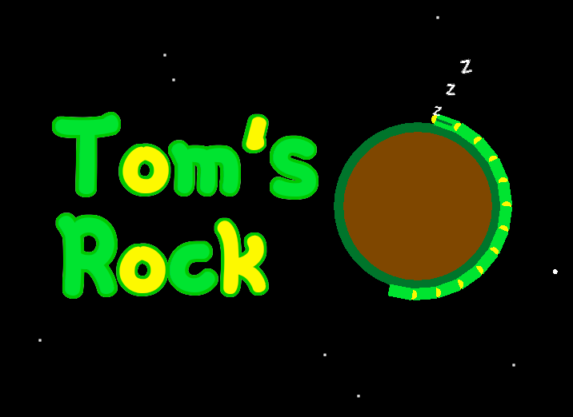

A game built in a month with Zig/Raylib for [OGAM#12](https://itch.io/jam/one-game-a-month-12) (theme: small world).

All sprites/music/sfx were created from scratch for the jam.

There are a few instances of zig features I was able to leverage, but
much of the code is jam-code and isn't written properly.

